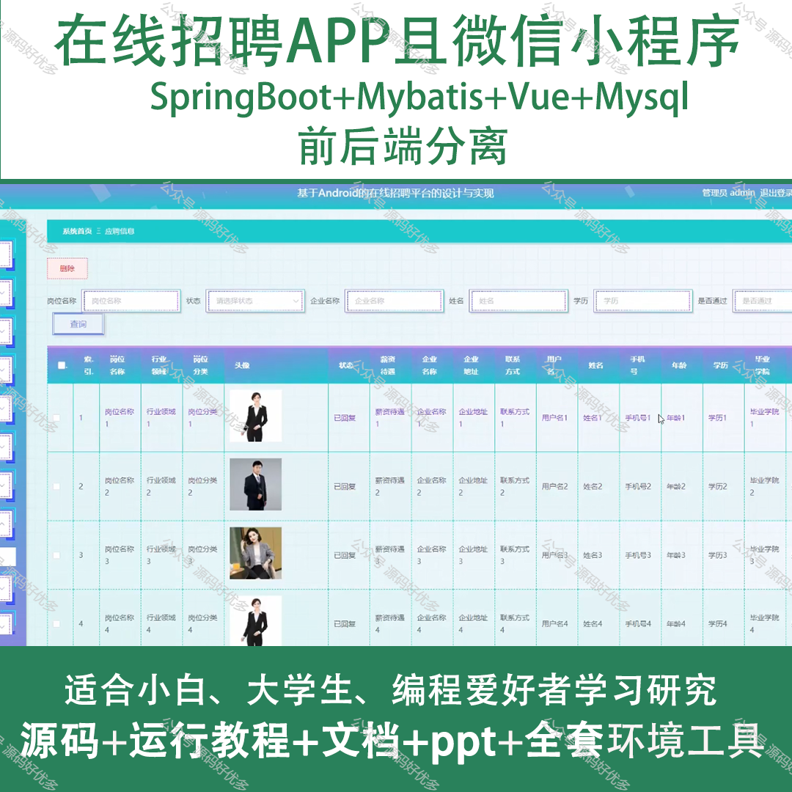
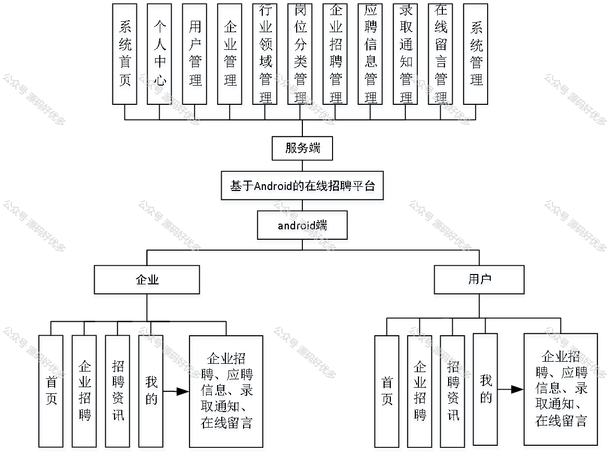
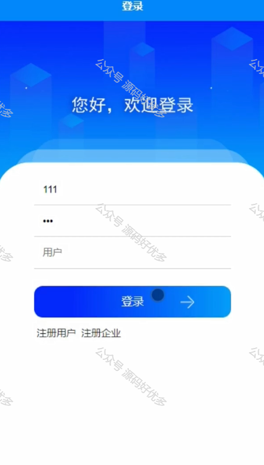
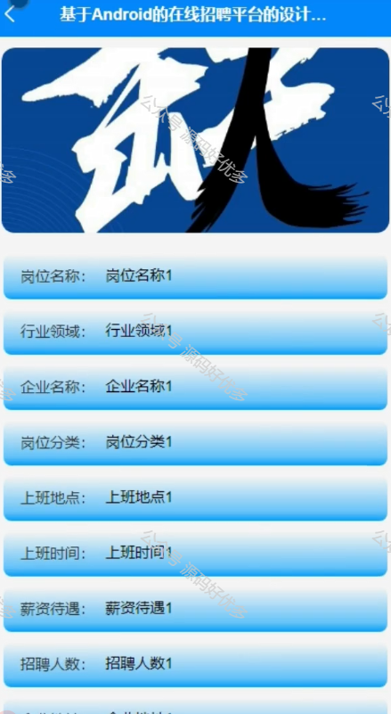
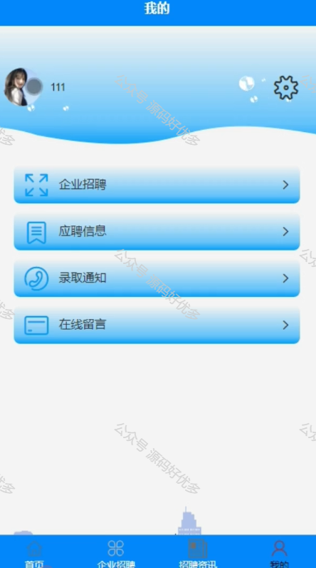
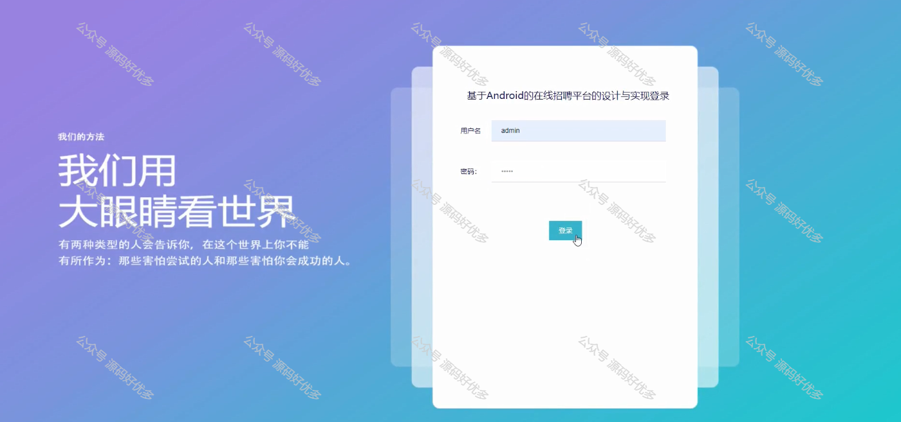
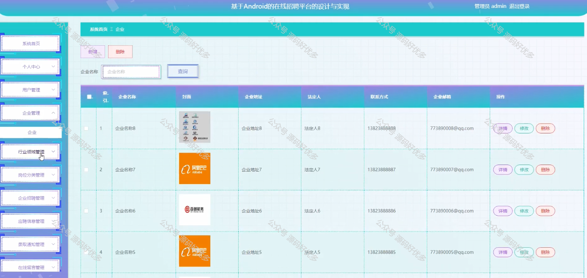
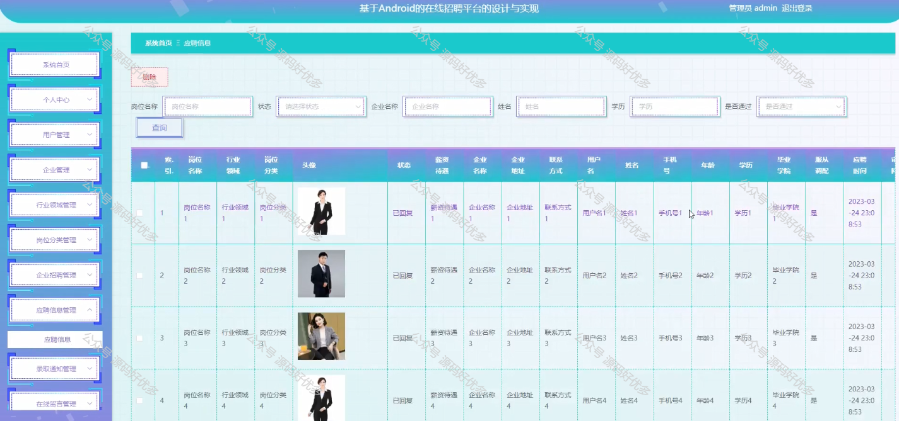
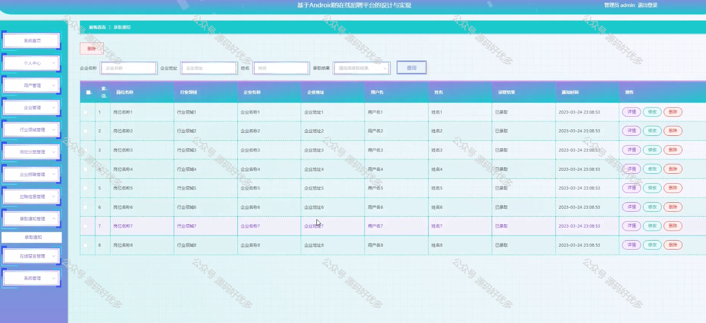
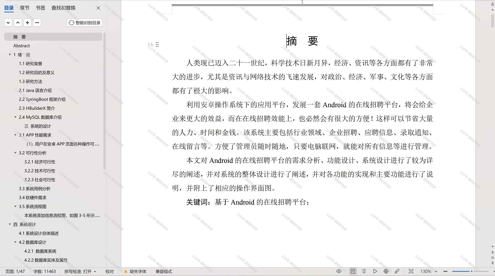

 
## 查看主页获取源码

> **作者介绍**： **✌**全网粉丝10W+本平台特邀作者、博客专家、CSDN新星计划导师、java领域优质创作者,博客之星、掘金/华为云/阿里云/InfoQ等平台优质作者、专注于项目实战 **✌**

  

### 一、作品包含

源码+数据库+设计文档万字+PPT+全套环境和工具资源+部署教程

### 二、项目技术

前端技术：Html、Css、Js、Vue、Element-ui

数据库：MySQL

后端技术：Java、Spring Boot、MyBatis

  

### 三、运行环境

开发工具：IDEA/eclipse + 微信开发者工具

数据库：MySQL5.7

数据库管理工具：Navicat10以上版本

环境配置软件： JDK1.8+Maven3.6.3

前端Nodejs：14

### 四、项目介绍
项目编号：mpweixinA044

在线招聘APP及微信小程序以当前就业市场的高度信息化和移动互联网普及为背景，为求职者和企业提供了一个便捷、高效的招聘求职平台。通过整合职位信息等功能，该应用旨在打破地域和时间限制，实现人才与岗位的精准匹配，推动就业市场的发展，同时为用户带来更加便捷的求职体验。

前台分为用户和企业
用户功能：首页、企业招聘、招聘资讯、应聘信息、录取通知、在线留言。
企业功能：首页、企业招聘、招聘资讯、应聘信息、录取通知、在线留言。

后台管理员的功能：系统首页、个人中心、用户管理、企业管理、行业领域管理、岗位分类管理、企业招聘管理、应聘信息管理、录取通知管理、在线留言管理、系统管理。

### 五、运行截图

  
